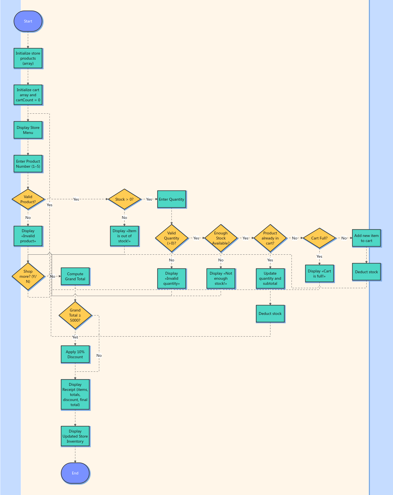

# Martinez_Marithe_ShoppingCartActivity

---

## Project Description 
This project is a console-based Shopping Cart System developed using C#. It simulates a simple skincare store where 
users can select products, input quantities, validate inputs, manage stock, and generate a receipt with a discount feature. 
The program demonstrates the use of object-oriented programming concepts such as classes, objects, methods, and arrays.

---

## Store Name
GLOW & CARE SKINCARE STORE

---

## Features
- Product menu display using an array of objects
- Input validation using int.TryParse()
- Stock management system
- Prevents purchasing beyond available stock
- Handles out of stock items
- Shopping cart system with:
  - Quantity tracking
  - Subtotal computation
- Prevents duplicate cart entries (updates existing items instead)
- Fixed cart size (maximum of 10 items)
- Continuous shopping loop (Y/N option)
- Automatic discount:
  - 10% discount if total is P5000 or more
- Receipt generation:
  - Itemized list
  - Grand total
  - Discount (if applicable)
  - Final total
- Display updated store inventory after checkout

---

## Concepts Applied
- Classes and Objects
- Arrays of Objects
- Methods
- Conditional Statements (if-else)
- Loops (do-while, for)
- Input Validation
- Basic Arithmetic Operations

--- 

## Project Structure
- Program.cs – Entry point placeholder (no implementation)
- Product.cs – Contains the full implementation including:
  - Product class
  - CartItem class
  - Main program logic (shopping cart system)
- README.md – Project documentation
- Flowchart.png – Visual representation of program flow

---

## How to Run
1. Open the project in Microsoft Visual Studio 2022 or 2026
2. Build the solution
3. Run the program
4. Follow the on-screen instructions to:
  - Select products
  - Enter quantity
  - Continue shopping or checkout
	
---

## Flowchart
- Menu display
- User input
- Validation
- Cart processing
- Checkout and receipt  

### Flowchart Image:

---

## AI Usage in This Project
AI tools were used in this project for guidance, debugging, and explanation purposes only. The program was written, organized, and tested by the student.
 
### 1. Specific parts where AI was used:
- Class Structure and Object-Oriented Programming:
  - Guidance on how to create classes such as `Product` and `CartItem`
  - Understanding how to define fields (Id, Name, Price, RemainingStock)
  - Understanding how to create and use methods like `DisplayProduct()` and `GetItemTotal()`
- Program Flow and Looping:
  - Guidance on how to structure the program from menu display → user input → validation → cart processing → receipt output
  - Understanding how a `do-while` loop works for continuous user interaction
- Input Validation:
 - Learning how to use `int.TryParse()` to safely handle user input
  - Applying validation for:
    - Product number (valid range only)
    - Quantity (must be a positive number)
- Cart Logic
  - Understanding how to store items using an array (`CartItem[]`)
  - Learning how to check if an item already exists in the cart
  - Updating quantity and subtotal instead of adding duplicate entries
- Stock Management
  - Guidance on checking available stock before allowing a purchase
  - Using simple methods such as `HasEnoughStock()` and `DeductStock()`
- Debugging and Error Fixing
  - Fixing issues such as:
    - Incorrect or repeated conditions
    - Loop structure issues
    - Misplaced braces affecting program flow
    - Input handling problems in the continue prompt (Y/N)

### 2. Why AI was used:
- To understand basic C# programming concepts as a beginner  
- To check if the program logic is correct  
- To fix errors more efficiently  
- To improve code structure and readability  

### 3. Prompts/Questions asked:
- How to create a Product class with methods in C#?  
- How to validate user input using int.TryParse()?  
- How to prevent duplicate items in a cart using arrays?  
- Why is my loop not working correctly?  
- How to check stock before deducting quantity?  
- How to handle invalid input for Y/N prompts?  
- How to compute totals and apply discounts?

### 4. After using AI for guidance:
- Rewrote and adjusted the code based on understanding  
- Fixed logical errors in loops and conditions  
- Improved input validation handling  
- Adjusted variable names and output messages  
- Organized the code for readability  
- Tested the program and corrected errors manually  

### 5. Academic integrity statement:
AI was used only as a guide for understanding concepts, debugging errors, and improving parts of the program.
All code submitted was:
- Written by the student  
- Reviewed and modified manually  
- Understood before submission  
The student is able to explain:
- Program flow  
- Cart logic  
- Input validation  
- Stock management  

AI was used responsibly.

Martinez, Marithe C.
 BSIT 1-2
 Computer Programming 2
 Polytechnic University of the Philippines - San Pedro Campus
